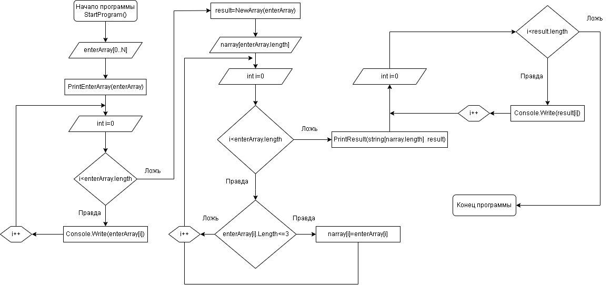

# Итоговая проверочная работа.
## Задача: ##
Написать программу, которая из имеющегося массива строк формирует массив из строк, длина которых меньше либо равна 3 символа. Первоначальный массив можно ввести с клавиатуры, либо задать на старте выполнения алгоритма. При решении не рекомендуется пользоваться коллекциями, лучше обойтись исключительно массивами.

## Алгоритм решения: ##
Задачу разбиваю на 4 метода.
1. метод StartProgramm()
Предлагаю пользователю ввести любые слова через запятую. Запятая служит сепаратором для нового значения элемента строчного массива. В данном методе прописаны вызовы последующих методов.
    * PrintEnterArray() - вывод в консоль введённого массива
    * NewArray() - функция(метод) создания нового массива с длинной элементов не более 3 исходног массива, введёного в консоли.
    * PrintResult() - печать результата нового массива длинна элементов которого равна либо меньше 3

Программа:
Для запуска программы перейдите в папку itog и запустите команду через терминал:

dotnet run 
Далее введите слова через запятую, например:

Введите любые слова: 21, Россия, Москва, Учёба, =)
Пример вывода программы:

Исходный массив: ['21']  ['Россия']  ['Москва']  ['Учёба']   ['=)'] 
Конечный массив: ['=)']
